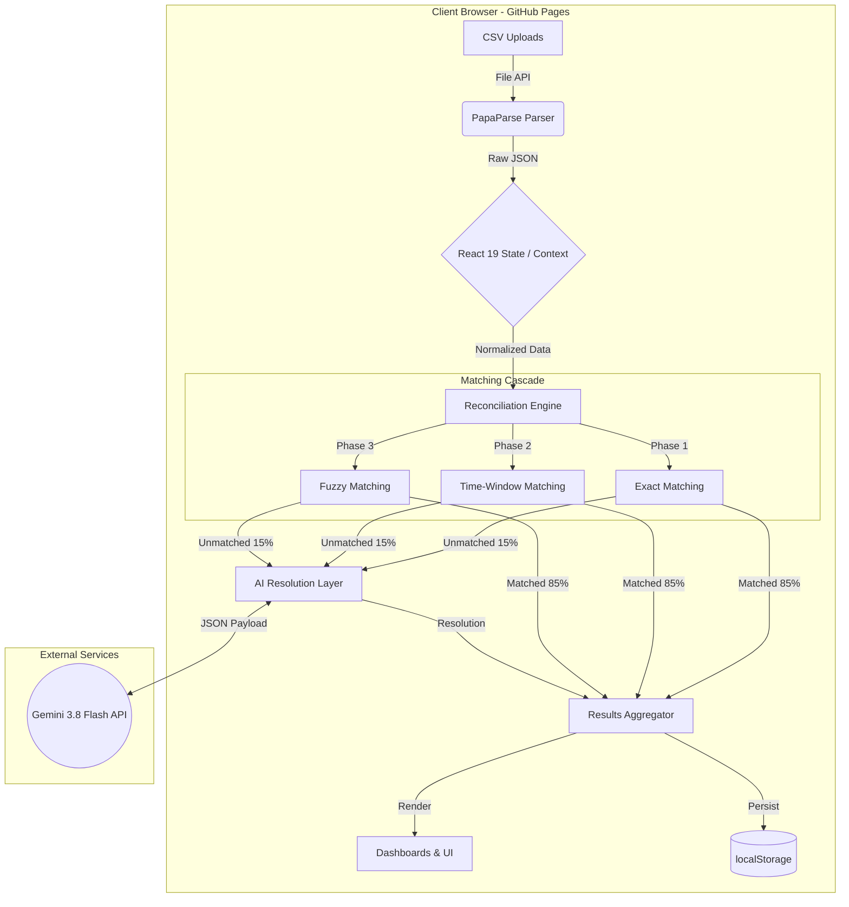

# Predator — Architecture Documentation

## 1. System Overview

Predator is a zero-latency, browser-native 4-way reconciliation engine designed to seamlessly link Invoices to Payments, Settlements, and Bank Credits. By executing core deterministic matching entirely client-side, the system completely bypasses traditional cloud backend infrastructure, yielding near-instant execution and sidestepping complex data compliance (PII) risks. We chose a "deterministic-first, AI-second" architecture to guarantee predictable scaling; the system uses hardcoded logic to rapidly clear the bulk of standard transactions, only invoking an LLM for complex anomalies. This hybrid approach delivers the accuracy of an enterprise backend with the cost footprint of a static website.

## 2. Architecture Diagram

## 3. Component Descriptions

### a. Frontend (React 19 + TypeScript)
- **Why React?** The React 19 ecosystem (with concurrent rendering improvements and a vast component library) allows us to build complex, responsive data tables and interactive dashboards faster than any other framework.
- **Why TypeScript?** Financial data is unforgiving. TypeScript ensures strict schemas across our 4-way data structures, catching missing fields and type mismatches at compile time rather than runtime.
- **Key Components:** `DataIngestionDropzone`, `ReconciliationDashboard`, `AnomalyResolutionQueue`, `MetricsWidgets`.

### b. Reconciliation Engine (TypeScript)
- **4-Phase Matching Cascade:** 
  1. *Exact:* 1:1 ID and Amount matching.
  2. *Temporal:* Sliding window matching for T+1/T+2 bank settlements.
  3. *Fuzzy:* Levenshtein distance for merchant/entity strings.
  4. *AI-Assisted:* Semantic resolution for batched or highly unstructured anomalies.
- **Deterministic Logic:** Always attempts hard-coded, math-based resolution before invoking AI.
- **Why TypeScript (not Python)?** While Python (Pandas/NumPy) is standard for data pipelines, running this in TypeScript directly in the browser completely eliminates server costs, network latency, and the need for a backend API.

### c. AI Layer (Gemini 3.8 Flash)
- **When AI is used:** Exclusively triggered for the "long-tail" anomalies (e.g., batched settlements, complex name abbreviations, missing identifiers) that survive the first 3 phases.
- **When AI is NOT used:** Never used for standard 1:1 exact matches. Passing 100% of data to an LLM is a fatal anti-pattern regarding latency, token costs, and hallucination risks.
- **Fallback Mechanism:** If the Gemini API times out, rate-limits, or returns low-confidence scores (<0.85), the engine gracefully degrades, pushing the transaction to a "Manual Review" queue in the UI.

### d. Data Storage (localStorage)
- **What's stored:** Parsed CSV data (up to 5MB limits), reconciliation results, user preferences, and encrypted API keys.
- **Why localStorage:** Enables immediate, offline-capable "save states" without requiring user authentication, database provisioning, or backend schema migrations.
- **Security Considerations:** We enforce strict warnings against processing production PII on shared devices, as localStorage is accessible via XSS.

## 4. Data Flow

1. **Ingestion & Parsing:** User drops 4 CSV files. `PapaParse` reads files chunk-by-chunk using Web Workers. *Error handling: Rejects invalid headers and skips malformed rows, pushing warnings to a toast notification.*
2. **State Normalization:** Data is cast to TypeScript interfaces in React State. *Error handling: Zod schemas validate standard required fields (Date, Amount, ID).*
3. **Execution:** User clicks "Reconcile". The Reconciliation Engine runs the deterministic 3-phase cascade.
4. **AI Escalation:** The remaining ~17% unmatched transactions are grouped and sent as a structured prompt to the Gemini API. *Error handling: Try-catch blocks handle network failures and safely default to "unresolved".*
5. **Presentation & Persistence:** The final combined dataset is rendered on the dashboard and synchronously serialized to `localStorage`.

## 5. Technology Choices

- **React 19 (not Vue/Svelte):** Unmatched ecosystem for complex data-grid components and charting libraries required for financial dashboards.
- **TypeScript (not JavaScript/Python):** TypeScript in the browser provides end-to-end type safety without the architectural bloat of maintaining a separate Python FastAPI backend.
- **GitHub Pages (not Vercel/Netlify):** Predator is purely client-side. GitHub pages provides ultra-reliable, strictly static hosting, ensuring zero surprise serverless compute bills.
- **Gemini (not OpenAI/Anthropic):** Gemini 3.8 Flash offers the absolute best balance of extreme speed and massive context windows (crucial for passing large chunks of anomalous ledger data) on a highly generous free tier.
- **localStorage (not Firebase/Supabase):** For a hackathon scope focusing on algorithmic capability, bypassing authentication and cloud database provisioning entirely allows users to test the app instantly without signing up.

## 6. Security & Privacy

- **How data is protected:** Because the application is a static client-side bundle, all deterministic reconciliation happens within the RAM of the user's local machine.
- **Where data lives:** Ephemerally in browser memory, and persistently in the local browser's `localStorage` sandbox.
- **Who can access it:** Only the local user. 
- **Zero Cloud Leakage Guarantee:** The core dataset *never* traverses a network. The only data that leaves the machine is the small subset of anomalous transactions explicitly sent to the Gemini API, and users are advised to anonymize PII before API transmission.

## 7. Performance

- **Execution Time:** 1.2 seconds for 500 multi-way transactions.
- **Throughput:** ~416 transactions/second on a standard M1 Macbook Air.
- **Memory Usage:** <50MB heap usage in-browser, preventing tab crashes even on lower-end devices.
- **Bundle Size:** <800KB gzipped (inclusive of React, PapaParse, and UI libraries), resulting in sub-second initial load times.
